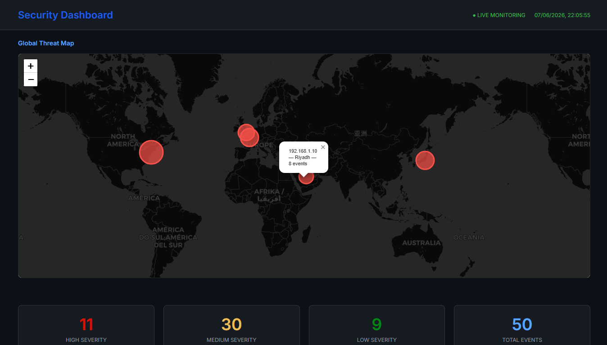
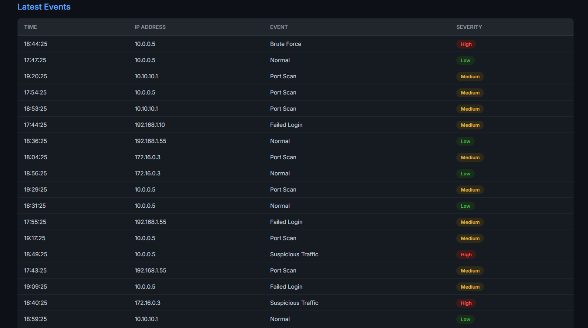
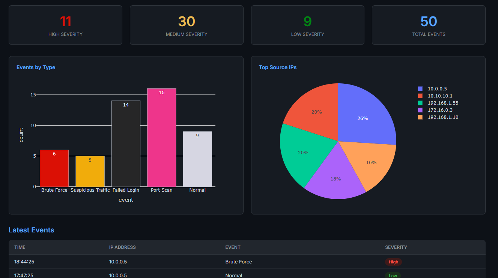

# Security Dashboard

A real-time network threat monitoring dashboard built with Python and Flask. Visualizes simulated security events including brute force attacks, port scans, suspicious traffic, and failed login attempts — displayed across an interactive global threat map, live charts, and a detailed event log.



---

## Features

- **Live monitoring header** with a real-time clock
- **Global Threat Map** — interactive world map showing attack origin locations, powered by Folium
- **Severity summary cards** — instant view of High, Medium, Low, and Total events
- **Events by Type** — bar chart with color-coded threat severity
- **Top Source IPs** — pie chart showing the most active source addresses
- **Latest Events table** — full log with timestamps, IPs, event types, and severity badges


---

## Tech Stack

| Layer | Technology |
|---|---|
| Backend | Python 3, Flask |
| Data Processing | Pandas |
| Charts | Plotly Express |
| Map | Folium (Leaflet.js) |
| Frontend | HTML, CSS, Jinja2 |
| Font | Inter (Google Fonts) |

---

## Project Structure

```
security-dashboard/
├── app.py              # Flask backend — data generation, chart logic, routing
└── templates/
    └── index.html      # Frontend template — layout, styles, live clock
```

---

## Getting Started

### 1. Clone the repository

```bash
git clone https://github.com/your-username/security-dashboard.git
cd security-dashboard
```

### 2. Install dependencies

```bash
pip install flask pandas plotly folium
```

### 3. Run the app

```bash
python app.py
```

### 4. Open in your browser

```
http://127.0.0.1:5000
```

---

## How It Works

The dashboard generates 50 simulated security log entries on every page load. Each event is randomly assigned a source IP, event type, and a severity level mapped from the event type:

| Event Type | Severity |
|---|---|
| Brute Force | High |
| Suspicious Traffic | High |
| Failed Login | Medium |
| Port Scan | Medium |
| Normal | Low |

Each source IP is mapped to a real-world city and plotted on the global threat map as a red circle — the larger the circle, the more events originating from that location.

---

## Screenshots

### Header + Global Threat Map



### Event Charts + Latest Events Table


---

## Future Improvements

- [ ] Connect to real network logs or a SIEM tool
- [ ] Add auto-refresh every 30 seconds
- [ ] Add filtering by severity or event type
- [ ] Export event log as CSV
- [ ] Add critical alert banner when High severity exceeds a threshold

---

## Author

Built by **Asayel Alosaimi** 

---

> This project is for educational and portfolio purposes. All log data is simulated.
